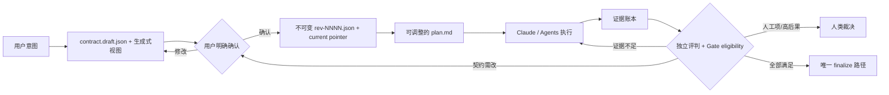

# AE v1：Codex 提案 · Claude Code 实现

> 状态：独立提案，不修改、不替代 `.ae/1.0/` 与外部 GitHub issue 材料
> 基线：当前仓库 `0.14.2`，2026-08-22
> 宿主：Claude Code 现有插件机制
> 版本边界：v1 先在 Claude Code 上做实；Codex 原生实现、跨 runtime 抽象与移植属于 v2

## 版本词汇表

| 名称 | 本文含义 |
|---|---|
| 当前 AE | `plugins/ae/.claude-plugin/plugin.json` 的 `0.14.2`；这是当前插件产品版本真值 |
| marketplace `1.0.0` | `.claude-plugin/marketplace.json` 的目录元数据，不代表 AE 插件已经发布 1.0 |
| 旧 `.ae/1.0` | 用户提供的既有本地提案，仅作引子，不是本文规格 |
| 本文 v1 | 当前 `0.14.2` 之后、目标 semver `1.0.0` 的 Claude Code 版 AE |
| 本文 v2 | v1 在 CC 上被证明后，才开始的 Codex 移植与跨 runtime 抽象 |

## 一句话结论

**AE v1 应从“多 Agent 工作流集合”收束成“由用户确认的交付契约驱动、以可重放证据决定完成的 Claude Code 闭环”。**

更短地说：

> **契约管边界，证据管完成，Agents 管执行，人在边界变化时裁决。**

v1 不承诺每次都得到最聪明的答案。它承诺一件更基础的事：**在受支持的 AE 流程内，revision 漂移、过期工作树证据、没有实际运行的检查、执行者自己的自评或不可验证的降级都不能被包装成“已完成”。**

## 中心思想：Executable Proof Loop

中文名：**可执行证明闭环**。

它由四个不可互换的部分组成：

1. **Acceptance Contract（交付契约）**：用户认可的意图、范围、约束和验收结果；执行者不能自行削弱。
2. **Execution Strategy（执行策略）**：计划、步骤、Agent 组合、TDD、并行方式；可在契约内自由调整。
3. **Evidence Ledger（证据账本）**：每次检查、产物判断、人工确认和失败尝试都追加记录，可从磁盘重放。
4. **Gate（完成闸门）**：只从不可变契约 revision 与证据账本派生每个 proof 的状态和 `finalize_eligible`；重试、询问或停止仍由 `/ae:work` 决定。

因此，v1 的关键分界不是 Claude / Codex / Gemini，也不是 Analyze / Discuss / Plan / Work / Review，而是：

- **什么是用户授权的正确性边界；**
- **什么只是可替换的执行方法；**
- **谁能声明事实，谁能判断事实，谁能改变边界。**

## v1 的三条硬约束

### 1. 考试题必须版本化

锁定后的目标、必需 AC、证明口径和非目标写成不可变 revision。发生实质变化时新增 revision 并进入显式 amendment；旧 revision 和旧证据不覆盖、不丢失。

### 2. 没有证据就没有完成

每条必需 AC 必须有一条可定位的证据链：

```text
AC → proof obligation → evidence event → adjudication → terminal status
```

`exit 0` 只证明命令退出了；LLM 的 `pass` 只证明它给出了判断。两者都不能单独冒充完整正确性。

证据同时绑定 source-set 内容摘要，而不只绑定 HEAD commit，因此同一 commit 下的 staged、unstaged 与相关 untracked 修改也会使旧证据过期。

### 3. 编排不是质量保证

多 Agent、Agent Teams、跨家族、Doodlestein 和 reviewer 数量都是策略。它们可以改善生成或提供独立判断，但不能替代契约、事实证据与完成闸门。

保证边界也必须诚实：Claude Code 当前若不给插件一个可独立验证的 user-turn credential，用户批准只能标为 `workflow_attested`，不能声称为不可伪造的 `host_verified`。v1 是 fail-closed 的工作流内核，不是同一 OS 用户权限域里的安全沙箱。

## Claude Code 上的 v1 纵向切片



现有 `/ae:*` 调用面继续存在，但职责收窄：

- `/ae:analyze` 提供项目事实，不定义完成。
- `/ae:discuss` 形成复杂任务的契约草案，并渲染人类可读视图。
- `/ae:plan` 为简单任务补建草案，为所有任务生成执行策略与证明映射，并承载一次明确的人类锁定动作。
- `/ae:work` 执行、取证、修复，不解析散落的自然语言状态，不改变锁定契约。
- `/ae:review` 只做机器无法独立完成的充分性判断与覆盖检查，不直接归档。
- 一个 CC 插件内的确定性 gate 工具负责 revision/pointer、账本归约、完成资格与最终 lifecycle 提交；它不调度 workflow。

## 为什么先在 Claude Code 上做

当前 AE 的真实实现已经深度使用 Claude Code 的 skill 发现、Agent、Agent Teams、Task 面板、AskUserQuestion、ToolSearch、MCP 与插件 hooks。v1 的目的不是抽象这些宿主能力，而是利用它们把当前闭环做可信：

- Skill 是薄入口和流程控制器；
- Agent 是 worker 或 fresh-context evaluator；
- Agent Teams 只在交互式协作确有价值时使用；
- Bash/确定性脚本测量事实；
- `.ae/` 文件承载跨 compaction、跨会话状态；
- Git 提供变更范围与 HEAD 身份，Gate 另记工作树 source-set 摘要；
- Codex/Gemini 在 v1 仍只是 Claude Code 内可选的独立判断席。

这不是未来 Core API。v1 新增的 gate 只是 **Claude Code 插件内部实现细节**，不承诺成为 v2 的跨 runtime 接口。

## 明确非目标

- Codex 原生 skill、AGENTS.md、Codex 权限或 tool 映射；
- Codex/Gemini 生产级移植；
- runtime-neutral AE Core、adapter API 或跨宿主 IR；
- 动态 Execution Graph、通用 Work Unit 调度器、daemon、数据库或 Web UI；
- 重写全部 24 个命令；
- 扩建知识图谱；
- 用 Agent 数、review 轮数或 SKILL 行数直接代表质量；
- 证明 LLM judge 永远正确。

## 文档清单

1. [`design.md`](design.md) — 中心思想、权限模型、数据模型、状态机、CC 落地方式与设计决策。
2. [`implementation-plan.md`](implementation-plan.md) — 分阶段实施顺序、工作包、文件影响面、退出与回滚条件。
3. [`acceptance-and-evaluation.md`](acceptance-and-evaluation.md) — v1 验收矩阵、故障注入、dogfood 与发布门。
4. [`current-implementation-map.md`](current-implementation-map.md) — 从当前代码反推的实现事实、可复用基础和必须替换的接缝。

## 材料使用边界

两组给定材料只作为问题线索和设计刺激。这里没有对它们做修订或合并，也不把它们的阶段、版本号或决策当作冻结规格。

本文判断“当前实现是什么”时采用的事实证据优先级是：

1. 当前仓库实际实现；
2. 当前可观察的 dogfood 产物与测试能力；
3. 给定材料对历史问题的记录；

规范性决定权则相反简单：**“v1 应是什么”只由本文的中心思想、设计决策和验收门决定。** 给定材料提供启发，不拥有否决权；当材料与代码不一致时，“当前是什么”以代码为准。

## 独立判断的可审计链

| 当前代码事实 | 本文决策 | 与给定材料的关系 |
|---|---|---|
| Plan 同时拥有 AC、recipe 和步骤 | 不可变 Contract revision 成为唯一验收真值，Plan 只做策略 | 接受“验收边界重要”的启发，但独立选择 versioned JSON + current pointer |
| Frozen goal 无 digest/approval | 显式用户锁定、revision history、digest、attestation、amendment | 不沿用旧计划的自动 freeze 形态，也不虚构宿主身份保证 |
| Evidence/verdict/state 分散在多文件和 skill | Append-only ledger + 可重放 reducer + 唯一 finalizer | 将“证据驱动”收敛成更小的 CC 内部真值核 |
| Teams/selection 协议大且不是机器真值 | Teams 降为协作策略，fresh Agent 可做 evaluator | 不以删除 Agent 数为目标，只按 proof obligation 保留 |
| 当前只有 Claude Code runtime | v1 明确 CC-specific；不做 Core/adapter | 采纳用户最新边界，主动拒绝材料中的移植分支进入 v1 |
