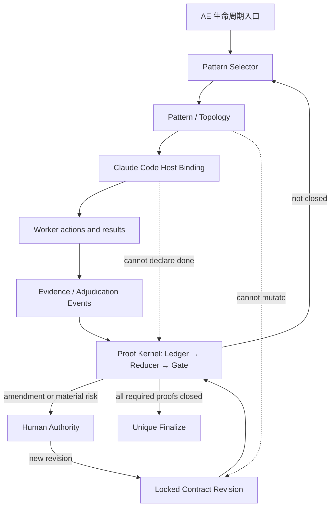

# AE v1 Agent Patterns 分层集成设计（Claude Code）

> 状态：Codex 独立研究与设计补充，不修改或替代 `../claude/patterns.md`、`../claude/*` 及本目录已有文档
> 基线：AE `0.14.2`，Claude Code 当前公开能力，2026-08-22
> 版本边界：v1 只讨论如何先在 Claude Code 上实现；Codex 原生移植与跨 runtime 抽象留给 v2

## 1. 结论先行

`patterns.md` 中的条目不在同一个抽象层：ReAct 是 worker 内循环，Evaluator-Optimizer 是跨 attempt 的反馈拓扑，Debate 是协作拓扑，LLM-as-a-Judge 是一种判断器，structured output 是边界格式，guardrail/tripwire 是执行约束，Agent Teams 则只是宿主 transport。

因此，AE 不应新增一组并列的 `react / reflexion / rewoo / debate` 功能或阶段。正确做法是：

> **AE 根据任务几何选择最小够用的 Pattern 组合；所有 Pattern 只能生产候选、事实或判断，始终服从同一个 Contract、Evidence Ledger、Gate 与 Human Authority。**

这与本目录既有 v1 中心思想“可执行证明闭环”形成自然关系：

- Proof Kernel 决定“什么算完成”；
- Pattern Policy 决定“这次怎么做、由谁做、怎样取证”；
- Claude Code 原语决定“在当前宿主上怎样运行”；
- 三者不能互相冒充。

v1 的最小复杂度阶梯是：

```text
单一 Claude worker
  → bounded subagent
  → fan-out / evaluator workflow
  → Agent Team
  → human interrupt
```

升级依据不是“任务看起来很大”或“多 Agent 更保险”，而是任务是否可分、是否需要独立上下文、是否需要 peers 持续交流、是否存在写入冲突、是否有明确外部反馈以及决策后果。

## 2. 研究边界与方法

本设计同时核对了三类事实：

1. `../claude/patterns.md` 对行业 Pattern、反证与 AE 映射的整理；
2. 当前 AE `0.14.2` 的 skills、agents、scripts、plugin manifest 与 CC dependency contract；
3. Anthropic/Claude Code 当前官方资料，以及 ReAct、Reflexion、ReWOO、自我纠错、Multi-Agent Debate 和 LLM judge 偏见的一手论文。

采用以下证据优先级：

```text
当前代码事实 > 当前宿主官方文档 > 原始论文 > 本文推演
```

行业名只用于辨认适用条件和失效模式，不进入 AE 用户词汇表。用户仍看到 `/ae:discuss`、`/ae:plan`、`/ae:work`、`/ae:review` 和 finalize，而不是一组论文术语。

## 3. 先拆开：这些“Pattern”实际属于什么

| 类别 | 条目 | 它实际回答的问题 |
|---|---|---|
| Worker 认知循环 | ReAct、Reflexion | 一个 worker 如何根据观察继续行动；失败诊断如何进入下一 attempt |
| Workflow 控制流 | Prompt Chaining、Routing、Parallelization、Plan-and-Execute、ReWOO、Evaluator-Optimizer | 工作如何分段、分支、并行、反馈与停止 |
| 协作拓扑 | Code Review Loop、Smart Friend、Manager/Workers、Multi-Agent Debate | 谁拥有控制权，谁独立工作，是否需要相互通信 |
| 判断机制 | deterministic evaluator、LLM-as-a-Judge、voting、pairwise comparison | 谁能对哪类证据作何种判断 |
| 边界协议 | structured output、seat contract、handoff packet | Agent 之间如何交换可校验的信息 |
| 执行约束 | guardrail、tripwire、approval、retry cap | 哪些动作必须阻断、暂停或升级给人 |
| 上下文与记忆 | context engineering、episodic memory | 本轮带什么，失败后保留什么，何时提升为长期知识 |
| 宿主原语 | Skill、Hook、Subagent、Dynamic Workflow、Agent Team、MCP、Worktree | 上述语义在 Claude Code 上由什么承载 |

这里最重要的三个去重关系是：

1. **Evaluator-Optimizer 是循环拓扑；Code Review 是角色隔离；LLM-as-a-Judge 是 evaluator 的一种实现。** 它们不是三套并行质量系统。
2. **Plan-and-Execute 与 ReAct 不是二选一。** Contract 保持稳定，strategy 可以重排；每个 attempt 内用 ReAct，跨 attempt 由 plan 和外部反馈约束。
3. **structured output 只保证形状，不保证内容真实。** Schema-valid 的虚构 finding 仍然是虚构 finding，必须继续检查 source、evidence 与 provenance。

## 4. 总体架构：一个真值平面，一套策略栈

### 4.1 两个平面



两个平面的边界必须是硬的：

- **执行平面**可以探索、计划、重试、并行、换模型、降级和失败；
- **真值平面**只接受绑定 contract revision、source snapshot、proof ID 和 evidence reference 的事件；
- Pattern selector 不能删 AC、降 proof 强度或把 unavailable 改写成 pass；
- Team task、mailbox、review prose、`/goal` verdict 和 TL 总结都只是输入或投影，不是完成真值。

### 4.2 六层策略栈

| 层 | 责任 | 放入的机制 | 权威边界 |
|---|---|---|---|
| L0 Proof Kernel | 定义并归约完成 | Contract、Evidence Ledger、Gate、Finalizer、Human amendment | 唯一 completion authority |
| L1 CC Enforcement | 在宿主边界执行约束 | Hook、permission、digest、capability probe、worktree | 可阻断动作，不作业务语义判断 |
| L2 Worker Loop | 完成一次局部尝试 | ReAct、TDD、tool feedback | 不能改 Contract，不能自判完成 |
| L3 Workflow Control | 组织 attempts 与独立任务 | chaining、routing、parallelization、orchestrator-workers、Evaluator-Optimizer、ReWOO-like fan-out | 只决定 execution strategy |
| L4 Collaboration & Judgment | 配置独立性、交流与评判 | reviewer、Smart Friend、cross-family judge、MAD、pairwise | 产出 finding/adjudication，不写终态 |
| L5 AE Lifecycle Projection | 给用户稳定流程 | analyze、discuss、plan、work、review、finalize | 组合下层能力，不复制其真值 |

Context、provenance、成本和 observability 横切 L1–L5。它们不是新的生命周期阶段。

## 5. 各 Pattern 在 AE 中的准确落点

### 5.1 ReAct：一次 attempt 内的默认动作循环

```text
inspect → choose action → edit/tool → observe → adjust
```

AE 当前 `/ae:work` 的 edit/test/observe 已有这一形状。v1 不实现 `ReAct engine`，只明确它的边界：

- 目标是当前 proof/step，而不是任意扩大 scope；
- 观察必须来自工具或环境，不以模型自己的“应该好了”替代；
- 正常实现意外可以调整 strategy；
- 触及 AC、proof strength、in/out scope 时退出 attempt，进入 amendment/human path；
- attempt 结束只产生 evidence，不能直接 finalize。

### 5.2 Evaluator-Optimizer：跨 attempt 的唯一修复循环

适用前提是“评价标准清楚，迭代能带来可测提升”。Anthropic 对该模式也明确给出这两个条件。[Building Effective Agents](https://www.anthropic.com/engineering/building-effective-agents)

建议形状：

```text
producer(single mutation owner)
  → instrument facts
  → fresh evaluator adjudication when needed
  → gate reduction
  → satisfied | bounded retry | replan | human
```

它应成为 `/ae:work` 跨 proof 的唯一外层修复循环。TDD、dev↔QA、pre-commit review、final review 和 Doodlestein 不再各自拥有一套隐含“完成循环”。

### 5.3 Reflexion：有证据的失败诊断，不是长期真值

Reflexion 的价值在于把环境反馈压缩成下一轮可用的语义记忆；原论文也依赖 evaluator/environment feedback，而不是无来源自我感想。[Reflexion](https://arxiv.org/abs/2303.11366)

AE 当前 `LOOP_FINDINGS` 只有 prose 摘要和 pass/fail 轨迹。v1 应把它提升成统一 Evidence Ledger event 的 `diagnosis` payload。下面只展示 payload 扩展；外层必须复用 `design.md:128-168` 已定义的统一 envelope，包括 `event_id / schema_version / feature / revision / contract_digest / ac_id / proof_id / attempt / source_snapshot / started_at`，不能另建一套较弱事件格式：

```json
{
  "kind": "diagnosis",
  "payload": {
    "failed_event_refs": [
      {"event_id": "ev-...", "content_digest": "sha256:..."}
    ],
    "expected": "...",
    "observed": "...",
    "violated_assertion": "...",
    "hypothesis": "...",
    "next_action": "...",
    "confidence": "low|medium|high"
  }
}
```

约束：

- diagnosis 是 hypothesis，不是 pass evidence；
- 没有 failed event/evidence refs 的反思不进入下一轮；
- 新 observation 可以推翻旧 diagnosis；
- 只有 feature finalize 后，经过独立复核的 durable lesson 才成为知识候选；
- 纯内在自我纠错可能退化，不能作为默认闭环。[Large Language Models Cannot Self-Correct Reasoning Yet](https://arxiv.org/abs/2310.01798)

### 5.4 Plan-and-Execute：稳定 Contract 上的可变策略

AE 不应冻结每一步，只冻结用户认可的正确性边界。

```text
Contract: stable until explicit amendment
Plan: current strategy projection, freely revisable inside Contract
ReAct: local execution inside one attempt
```

因此 plan 只引用 AC/proof ID，描述步骤依赖、预期 touched files 和初始策略。权威 `source_set / criterion / closure / independence` 属于锁定的 proof，plan 和 selector 只能只读投影，不能重算或缩窄。工具反馈推翻步骤时允许 replan；工具反馈推翻需求或证明口径时必须 amendment。

### 5.5 ReWOO：只借 fan-out/fan-in 形状，不造新引擎

ReWOO 将规划、工具执行和合成解耦，适合预先可枚举、worker 间没有中间依赖的工作。[ReWOO](https://arxiv.org/abs/2305.18323)

AE 最合适的落点是 review/research：

```text
proof manifest
  → independent evaluator jobs
  → facts/adjudications
  → deterministic reduction
```

不要把 ReWOO 用于动态编码主循环：它不根据每个中间 observation 立即调整后续 action。也不应在 AE 内实现 ReWOO graph；Claude Code Dynamic Workflows 已能承载大规模、可重跑的 fan-out。

### 5.6 LLM-as-a-Judge：语义 proof provider，不是 Gate

Judge 的输入应最小化到一个明确问题：

- 单个 AC/proof；
- rubric；
- required source set；
- 对应 diff/artifact/test bodies；
- facts-only evidence；
- contract/source snapshot digest。

Judge 不读取 producer 的自我总结，不凭报告长度推断质量。对于 material fact claim，先读 source 形成独立答案，再看被评 artifact。Cross-family 是 judge seat 的 independence/assurance 属性，不是所有 team 的默认成员。

Pairwise 只适合选择候选方案或修复；A 胜 B 不代表 A 达到 Contract。最终仍需 absolute rubric/reference proof。若使用 pairwise，应交换或随机化顺序，因为位置偏见是已测的系统误差。[Judging the Judges](https://aclanthology.org/2025.ijcnlp-long.18/)

### 5.7 Multi-Agent Debate：高影响竞争假设的升级路径

MAD 只在同时满足以下条件时启用：

1. 存在至少两个可证伪的竞争假设；
2. 决策后果足够高，普通 reviewer 不足；
3. Round 1 先独立取证，之后才相互挑战；
4. 声称 heterogeneous 时，backend 实际到达并有可关联 receipt/attestation；
5. 有明确终止条件、最大轮数与 unresolved → human 路径。

普通 code review 不升级为 debate。系统研究表明，MAD 并不稳定优于简单 baseline，模型异质性和评估设计会实质影响结果。[Stop Overvaluing Multi-Agent Debate](https://arxiv.org/abs/2502.08788)

Debate 的输出是 decision candidate、counterexample 和 unresolved set，不是 completion proof。

### 5.8 Structured Output、Guardrail 与 Tripwire

三者应分工：

- Structured Output：验证消息形状；
- Guardrail：阻断不允许的动作或输入；
- Tripwire/Gate：发现契约、证据或状态条件不满足时停止继续完成路径。

Result schema-valid 但 source 不存在、receipt 不可关联或 evidence stale 时，结果仍为 `invalid`。TL 不应“顺手修好”非法 JSON 后再替 Agent 背书；应记录 invalid，并按 policy retry/degrade。

### 5.9 Memory：本轮诊断与长期知识分开

```text
run-local episodic diagnosis
  ≠ finalized durable lesson
  ≠ completion evidence
```

只有完成后才考虑知识提升；知识可以影响下一任务的 context selection，但不能反向改变已经锁定的 Contract 或当前 Gate eligibility。

## 6. Pattern Selector：按任务几何，不按角色清单

### 6.1 三组输入，不是一份可自由重算的六维标签

Selector 的输入分三组。第一组来自 locked Contract，只能读取；第二组才是可重算的任务几何；第三组是每次运行时探测的宿主能力。

| 输入组 | 字段 | 权威与作用 |
|---|---|---|
| locked proof constraints | proof kind、criterion、source set、closure、required independence/family/assurance、consequence | Contract 权威；selector 只能满足，不能降级改写 |
| task geometry | control flow: fixed/adaptive | chaining/workflow 还是 agentic loop |
| task geometry | decomposition: none/independent/dependent | 是否值得 fan-out |
| task geometry | interaction: return-only/peer-exchange | ordinary subagent/workflow 还是 Team |
| task geometry | mutation: none/disjoint/overlapping | 是否允许并行，是否必须单 writer |
| host capability snapshot | Teams 状态、workflow 可用性、named-Agent 语义、worktree、backend/receipt | 决定当前 CC binding 与显式 degrade 路径 |

`verification / independence / consequence` 不是 selector 的意见；它们来自当前 Contract revision。Host capability 缺失也不能让 selector 降低 required assurance，只能选择等价 fallback 或进入 `unavailable/human_required`。

### 6.2 选择规则

```text
1. Contract 尚不清楚？
   → discuss/clarify；不是先加 Agent。

2. 单 worker + 环境反馈足以完成？
   → ReAct，默认路径。

3. 有一个清晰、bounded、只需回传结果的旁任务？
   → fresh subagent。

4. 有多个彼此独立的 research/review/proof jobs？
   → fan-out/fan-in；小规模用 subagents，大规模可复用时用 Dynamic Workflow。

5. 子任务无法预先枚举，但 lead 可动态分解？
   → orchestrator-workers；lead 保持控制。

6. 评价标准清晰且失败可修？
   → bounded Evaluator-Optimizer。

7. peers 必须持续交流、任务认领或相互挑战？
   → Agent Team。

8. 存在高影响竞争假设？
   → heterogeneous independent-first debate；否则不用 MAD。

9. 涉及 overlapping mutation 或同一产品决策？
   → 一个 mutation owner；其余 seats 只提供 intelligence/evidence。

10. Contract 变化、人工 proof、不可逆动作或 retry cap 耗尽？
    → human interrupt。
```

### 6.3 常见任务的默认选择

| 任务形状 | 默认组合 | 不采用 |
|---|---|---|
| 低风险 command-only 小改 | single writer ReAct → command runner → Gate | Team、Debate、LLM judge |
| artifact/form 判断 | single writer + 1 fresh-context judge → Gate | 固定 5 人 review |
| self-authored material fact | single writer + source-first independent/cross-family judge → Gate | same-context self-pass |
| 广度研究/依赖扫描 | read-only manager fan-out/fan-in | 并行修改共享代码 |
| 大量同构文件审计 | Dynamic Workflow + adversarial verify + one reducer | Team mailbox 手工收集几十个结果 |
| 不可预知的复杂调查 | orchestrator-workers，按发现动态再分解 | 预写完整 ReWOO plan |
| 真正的架构/范围争议 | independent-first Team discussion；必要时 debate | 默认 forced FOR/AGAINST |
| proof fail | evidence-grounded diagnosis → bounded optimizer retry | 无外部反馈的 self-refine |
| 两个候选实现 | pairwise/order-swap 选候选 → 再做 absolute proof | 以“胜出”直接 finalize |

## 7. 并发原则：不是简单的“读并行、写单线程”

真正需要串行的是**冲突的隐含产品决策和重叠 mutation**，而不只是文件写系统调用。

允许并行：

- 独立 research、code search、test observation；
- 每个 reviewer 自己的私有 findings artifact；
- 不同 proof 的只读 evaluator；
- 机器检查与语义 judge 在依赖允许时的并行取证。

必须串行或单一集成者：

- 同一文件或重叠 source set 的修改；
- 会改变同一用户可见行为的相互依赖实现；
- Contract amendment；
- evidence reduction 与 finalization；
- 对多个并行候选作最终产品取舍。

v1 硬约束是“一 feature 一 active mutation owner”，包括 Dynamic Workflow：v1 workflow presets 全部只读。独立 worktree + 不相交 ownership + 显式 integration owner + 合并后重新取证只是未来开放并行 mutation 的改主意条件，不是 v1 例外；v1 不为它自造 scheduler。

## 8. Claude Code v1 的原生映射

### 8.1 原语选择表

| CC 原语 | v1 中的职责 | 不承担 |
|---|---|---|
| Skill | 稳定 `/ae:*` 入口、读取 policy、发起 host operation | 真值存储、通用 workflow engine |
| 普通 Subagent | bounded side task、fresh-context reviewer、manager worker；结果返回 caller | peer society、长期状态 |
| Dynamic Workflow | 大规模可重放的只读 fan-out、cross-check、批量审计 | 用户中途 amendment、completion truth、v1 并行 mutation |
| Agent Team | peers 持续通信、共享任务认领、竞争假设 | 默认 review、持久 feature state |
| Hook | 强制执行可确定的边界、记录 host event、阻断工具调用/假完成 | 复杂业务语义判断 |
| `/goal` | 让当前 session 按一个可见条件持续迭代 | 独立读文件、跑命令、AE evidence gate |
| MCP proxy | 提供不同 family/capability 的 seat | 自动证明 backend 真到达 |
| Worktree | 隔离真正需要的并行 mutation | 自动消除产品决策冲突 |
| Task list/mailbox | 临时 coordination blackboard 与 UI | ledger、Contract、proof terminal state |

Claude Code 官方对并行原语已有明确区分：subagent 是返回结果的隔离 worker；Team 是带共享 task list 和消息的 peers；Dynamic Workflow 由脚本持有 plan、loop、branch 和 intermediate results。[Agents and parallel work](https://code.claude.com/docs/en/agents)

但 v1 不能把这三者当成同一 session 内可随意切换的函数。Agent Teams 开启后，interactive session 中带 `name` 的 `Agent` 会成为 teammate；普通 subagent 的结果返回 caller，而 teammate idle notification 不携带结果，必须通过 mailbox/Task 显式回传。等待 subagent return 的编排如果误 spawn 了 teammate 会卡住。[Agent Teams：subagent/teammate 干扰](https://code.claude.com/docs/en/agent-teams)

因此每个 session 先建立一个轻量 host-state snapshot，而不是仅按 work unit 猜 binding：

```text
teams_enabled: true | false
session_team_state: absent | implicit-active
spawn_kind: anonymous-subagent | named-teammate
result_channel: return-value | SendMessage-and-ledger
workflow_available: true | false
```

硬规则：

- 需要 ordinary subagent return semantics 时，interactive Teams-enabled session 只能使用经 live contract test 验证的匿名 `Agent` 调用，或在 Teams 关闭/新 session 中运行；不得给它 `name` 后仍等待 return value。
- 需要 Team 时用当前 CC 的 named `Agent` 隐式 teammate 语义；result 必须经 `SendMessage`/结构化 artifact 回流，不能假设调用返回正文。
- 一个 session 只有一个隐式 team；selector 不能在同一 session 中假装创建多个 named teams。
- non-interactive `-p`/Agent SDK 的 teammate 行为不同，必须作为独立 host state 测试，不能从 interactive dogfood 外推。

### 8.2 Dynamic Workflows：可选加速器，不是新硬依赖

当前官方 Dynamic Workflows 可以：

- 由脚本持有 loop、branch、fan-out 与中间结果；
- 运行大量 subagents 并交叉验证；
- 保存为插件 `workflows/` 中的可复用命令；
- 在同一 session 内暂停/恢复；
- 让主会话只接收最终压缩结果。

这意味着 AE v1 不应实现通用 graph/orchestration runtime。适合固化为 workflow preset 的候选只有：

1. codebase-wide read-only audit；
2. per-proof review fan-out + cross-check；
3. 多来源 research + citation verification。

但它必须是 optional capability：workflow 有版本/套餐/config 条件；运行中不能接收普通用户输入；停止后跨 session 不保留 run；大 fan-out 有真实 token 成本。其 subagents 固定运行在 `acceptEdits`，文件编辑会自动批准，所以 v1 的业务 workers **只允许读取产品 source/artifact**，不承接 migration 或实现写入；唯一例外是受限的 `ledger-recorder`，它只能通过 canonical gate CLI 追加 `.ae/` evidence event，不能编辑产品代码或 Contract。发生 Contract amendment、产品 mutation 或 human proof 时，workflow 必须退出到前台 AE 生命周期，再继续下一段。[Dynamic Workflows](https://code.claude.com/docs/en/workflows)

#### Workflow → Ledger 证据桥

Workflow script 自身不能直接访问 filesystem/shell，中间值又默认留在 script variables；只把最终 synthesis 发回主会话会丢失 per-seat 原始结果和部分失败。因此 AE preset 必须额外满足：

1. 每个 worker 返回固定 `ae.workflow-seat.v1` 结构，包含 `workflow_run_id / seat_id / attempt / input manifest / artifact or finding / citations / error|null`；
2. `null`、timeout、rate limit 和 schema invalid 保留为 `unavailable/invalid`，禁止用 `filter(Boolean)` 静默丢弃；
3. fan-out 后只有一个 `ledger-recorder` agent 获得受限账本写权限，它把每个 seat result 通过 canonical gate recorder 写成完整 event envelope；其他 workflow agents 对产品与 `.ae/` 都只读；
4. recorder 使用 `(workflow_run_id, seat_id, attempt)` 作为幂等键，并返回持久化后的 `event_id + content_digest`；没有 recorder ack 的 workflow 结果不具 proof 权威；
5. workflow 中断时，已写入 ledger 的 events 保留，未 ack 的 seats 在下一 run 重做；跨 session 重新启动 workflow，Gate 只按 ledger 重放，不相信 workflow UI cache；
6. synthesis 只能引用已持久化 event IDs；Gate 仍在 workflow 外独立 evaluate。

这条桥是启用任何 AE workflow preset 的前置条件，不是后续优化。

### 8.3 Agent Teams：只用于交互型协作

官方建议 Teams 用于 research/review、分离 ownership 的模块、竞争 debugging hypotheses 和跨层协调；对 sequential task、same-file edit 或依赖密集工作，单 session/subagents 更合适。[Agent Teams](https://code.claude.com/docs/en/agent-teams)

对 AE 更关键的是当前限制：

- Teams 仍为 experimental；
- in-process teammates 不随 `/resume`/`/rewind` 恢复；
- task status 可能滞后；
- 一个 session 只有一个 team，lead 固定，不能 nested team；
- 同文件并行编辑会覆盖；
- Team 的 task completion 和 lead approval 都不等于用户批准或 feature completion。

所以 Team task list 只能是 coordination blackboard。真正状态必须落到 `.ae/` ledger，由 Gate 重放。

### 8.4 当前宿主漂移必须先解耦

当前本仓 `docs/references/cc-plugin-contract.md:28` 仍把 `TeamCreate` / `TeamDelete` 列为 live dependency；当前官方文档则说明，自 Claude Code v2.1.178 起两者已经不存在，teammate spawn/cleanup 改为隐式行为。[Agent Teams 当前架构](https://code.claude.com/docs/en/agent-teams)

这不是要求本研究去修原文档，而是一个架构信号：

> **Pattern 语义不能绑定某个 CC 工具名。v1 的 host binding 必须先 capability probe，再选择当前可用调用形态；缺失时显式降级。**

例如“interactive peer discussion”是 AE 语义；当前 binding 是 Teams-enabled interactive session 中的 named `Agent`。`team_name` 当前 accepted-but-ignored，应省略；过去的 `TeamCreate` 和未来 API 都只是宿主实现。

### 8.5 `/goal`：可复用 continuation，不是 Proof Kernel

`/goal` 每 turn 使用 fresh evaluator 检查会话中呈现的条件，适合让 session 继续工作；但该 evaluator 不能独立读文件或运行命令，只看 transcript 中 Claude 已经展示的内容。[Claude Code Goals](https://code.claude.com/docs/en/goal)

因此：

- 可用它承载“继续直到 AE Gate 报告 eligible 或 cap 到达”的 UX；
- 不能用 `/goal says achieved` 代替 evidence event；
- Claude 必须实际运行 proof 并把结果写入 ledger；
- Gate 的输出可以成为 `/goal` 可见信号，反向不成立。

### 8.6 Hooks：执行边界，不是另一套 judge

官方 Hook 在宿主生命周期点自动运行，适合保证某些检查必然发生，而不是等模型主动想起。[Claude Code Hooks](https://code.claude.com/docs/en/hooks-guide)

v1 候选映射：

| Hook | AE 用途 |
|---|---|
| `PreToolUse` | 对 locked Contract/terminal path 的直接写入给出早期阻断 |
| `PostToolUse` / `PostToolUseFailure` | telemetry 或触发 runner/snapshot 更新；原始 hook payload 不直接成为 proof evidence |
| `SubagentStop` | 要求 result receipt/schema，缺失则 invalid |
| `TaskCompleted` | 防止 Team task 无交付物就标完成；仍不等于 feature pass |
| `Stop` | 若 AE run 仍 active 且未闭合，提供 continuation/阻断提示 |
| `SessionStart` / `PostCompact` | 从磁盘重注入 current revision 与 open proofs |

Hook 只做确定性或清晰可分类的边界。`PreToolUse` 是早期 guard，最终 digest/Gate 才是 hard backstop；`PostToolUse` 已发生在动作之后且不能撤销结果，默认只算 telemetry。任何 hook 事实都必须先由 canonical runner/recorder 补齐统一 envelope、snapshot、digest 与 proof binding，才可成为 evidence，不能形成绕过 G2 的第二条事实通道。语义充分性继续由独立 judge 产生 adjudication，并由 Gate 消费。

## 9. AE 生命周期中的有机投影

### `/ae:analyze`

- 默认 single agent；
- 代码面很广、问题可独立切分时使用 read-only manager fan-out；
- 输出项目事实、risk 与 Contract draft input；
- 不定义完成，不把研究共识写成 AC truth。

### `/ae:discuss`

- 先做 scope/contract clarification；
- 默认 independent perspectives + TL reduction；
- 能力缺口用 Smart Friend；
- 只有真实竞争假设才升级 Team Debate；
- heterogeneous claim 缺 receipt/attestation 时必须标为 `homogeneous_degraded` 或 `unavailable`；
- debate 结论仍是 Contract draft，由人锁定 revision。

### `/ae:plan`

- Plan-and-Execute 只生成可变 strategy；
- 每个 step 引用 proof IDs，不复制权威 AC；
- 运行 Pattern Selector，记录为什么选 solo/subagent/workflow/team；
- 选择可以在 Contract 内重算，不需用户批准；
- 改 proof 强度、scope 或 AC 时进入 amendment。

### `/ae:work`

- 一个 feature 一个 mutation owner；
- 每个 attempt 内 ReAct/TDD；
- command proof 先用 instrument，不为“保险”加 judge；
- artifact proof 交 fresh evaluator；
- failure 生成 diagnosis event，再进入 bounded Evaluator-Optimizer；
- findings 不变到 cap → replan/human，而不是无限 self-refine。

### `/ae:review`

- 从“全功能多 Agent 大会”收缩为 proof manifest 的 fan-out/fan-in；
- 一个 evaluator 回答一个 rubric/proof question；
- reviewer 先独立形成结果，再按需要 cross-check；
- TL 不自由改写 evidence 或替非法 result 补格式；
- Gate 做唯一 closure reduction；
- Debate 不是默认 review mode。

### Finalize

- 不 spawn agent，不看 Team task list，不读取“最后一份 review prose”作为真值；
- 只接受当前 Contract revision 对应的 ledger/reducer 状态；
- 幂等、唯一写入口；
- knowledge promotion、roadmap/graph 等是完成后的非阻塞副作用。

## 10. 最小内部协议

v1 不需要建立通用 Pattern DSL。只需要在 plan/run trace 中记录一次轻量 dispatch，使选择可观察、可评测、可降级。

### 10.1 Pattern Dispatch Record

```yaml
dispatch_id: pd-001
proof_ids: [P3]
locked_constraints:              # verbatim projection; selector cannot edit
  contract_digest: sha256:...
  proof_kind: artifact
  source_set_digest: sha256:...
  required_independence: fresh_context
  required_family: non_author_family
  required_assurance: host_correlated
  consequence: high
task_geometry:
  control_flow: adaptive
  decomposition: independent
  interaction: return-only
  mutation: none
host_snapshot:
  teams_enabled: false
  workflow_available: true
  required_backend_available: true
pattern: fanout_reduce
host_binding: subagents        # solo | subagents | workflow | team
seats:
  - seat: source-first-reviewer
    independence: fresh_context
    family: non_author_family
writer_scope: none
stop:
  success: all_required_results_valid
  max_rounds: 1
fallback:
  workflow_unavailable: subagents
  required_family_unavailable: human_required
rationale: material self-authored fact claim
```

它属于 Execution Strategy，不是 Contract。`task_geometry / host_snapshot / pattern / host_binding / seats` 可以重算，但 `locked_constraints` 必须与当前 Contract revision 的 proof byte-for-byte 对应；任何 required independence/family/assurance 的变化都必须走 amendment。每次重算要留 trace，方便验证 selector 是否真的按任务几何工作。若 dispatch 进入统一 event log，它是 policy/observability kind，Gate reducer 的 completion 白名单不得消费它。

### 10.2 Seat Contract

每个 seat 只需要：

```text
seat_id / role
objective
proof_ids
required source inputs
excluded narrative/context
allowed tools
write ownership
independence requirement
result schema
required evidence/provenance
stop conditions
authority: propose | execute | measure | adjudicate
```

当前 Cast 的 `Role / Angle / Why` 可以作为人类可读投影，但不能替代这些执行约束。

### 10.3 Seat Result、Judge Verdict 与 Backend Attestation 必须分离

这里不新增一套弱化的 evidence schema：

- 普通 worker 的 `ae.seat-result.v1` 是 transport/artifact，只有放入统一 event envelope、记录 input/artifact content digest 后才进入 Ledger；finding 本身不带 pass 权威。
- Judge 必须继续使用既有 `implementation-plan.md:224-251` 的 `ae.judge.v1`：`evidence_refs` 是 `{event_id, content_digest}` 对象，并包含 `source_snapshot_digest / rationale / citations / independence`；Judge event 外层仍是统一 envelope。
- Backend reachability/attestation 是独立 `backend_invocation` event，由 host/MCP 可观察通道记录 `family / invocation_id / started_at / terminal status / trace digest`。Judge verdict 只引用它，不把 backend 自述内嵌成证明。

一个非权威 seat transport 可以长这样：

```json
{
  "schema": "ae.seat-result.v1",
  "seat_id": "source-first-reviewer",
  "proof_id": "P3",
  "inputs_used": [
    {"path": "src/x.ts", "content_digest": "sha256:..."},
    {"path": "artifact/P3.md", "content_digest": "sha256:..."}
  ],
  "artifact_refs": [
    {"path": "run/results/seat-1.json", "content_digest": "sha256:..."}
  ],
  "uncertainty": "...",
  "backend_attestation_ref": "ev-backend-17"
}
```

Receipt absence可以让 required 结果不被采纳；agent 自写的 receipt presence 不能单独证明 backend 真被调用。能拿到 host/MCP trace 时必须关联外部 `backend_invocation` event。任何会影响 proof closure 的结果都必须满足 `acceptance-and-evaluation.md` G2，而不是只满足本节 transport schema。

## 11. 从当前 AE 实现出发的具体判断

| 当前事实 | 现状锚点 | Pattern 结论 |
|---|---|---|
| TL 同时是 moderator、judge、synthesizer、final caller | `agent-teams/SKILL.md:24-31` | 协作控制与 proof adjudication 耦合；v1 分开 TL orchestration 与 Gate authority |
| 一个 Team 活完整生命周期 | `agent-teams/SKILL.md:33-42` | 把 Team transport 当成 lifecycle；v1 按 work unit 选 host primitive |
| Round 1 已有 independent-first | `agent-teams/SKILL.md:148-163,280-292` | 保留为 debate/review 的独立性原语 |
| 每条 finding 要 file:line/evidence | `agent-teams/SKILL.md:182-189` | 保留意图，升级为 result/evidence refs，而非 prose 要求 |
| Doodlestein 在 Debate/Discussion 总是触发 | `agent-teams/SKILL.md:199-208` | 应按 risk/uncertainty 触发，不按 team close-out 固定触发 |
| plan/review 被统一称为 Debate Mode | `agent-teams/SKILL.md:255-278` | 普通 plan/review 实际更像 independent fan-out evaluation；Debate 只保留竞争假设 |
| work 并行 spawn dev/QA，QA fresh context | `work/SKILL.md:186-251` | fresh evaluator 可保留；同 feature mutation owner 必须唯一 |
| work 已有 disk-backed loop 与 cap | `work/SKILL.md:536-591` | 直接收敛为唯一 bounded Evaluator-Optimizer；`LOOP_FINDINGS` 升 diagnosis event |
| review 已做 instrument + isolated judge | `review/SKILL.md:215-228` | 是 Proof Kernel 的正确起点；拆成 facts/adjudication/reduction |
| discuss 已做 independent → share → UAG | `discuss/SKILL.md:391-414` | 可保留为 discussion topology；不要扩散成所有阶段默认流程 |
| proxy receipt 规则只在 discuss 真正过滤 | `agent-selection/SKILL.md:346-362` | 收进统一 ledger admissibility，不在各 skill prose 中重复 |
| Task/notes/review/trace 多套状态 | `current-implementation-map.md:58-109` | coordination 与 truth 分平面；ledger 是权威，其他都是投影 |
| 当前 hooks 只有 SessionStart/SessionEnd | `plugins/ae/.claude-plugin/plugin.json` | protected write/task/stop 边界尚未 host-enforced；v1 按能力逐步加 |
| 当前 AE 未使用 Dynamic Workflows | 当前仓库无 workflow declaration/调用 | 可作为 P5 后的可选优化，不阻塞 Proof Kernel |

两个具体职责冲突值得在实施时优先消掉：

1. `review` 的 challenger 一边被要求 compare/merge/aggregate，一边又被要求 pure opposition、不得 synthesize，而 TL 自己还负责 synthesis。v1 应让 challenger 只返回 challenge/adjudication，reduction 唯一发生在 Gate/TL 的受约束步骤。
2. Round 1 isolation 一处被描述为“不写共享 discussion 目录”，另一处又要求每个 seat 写 `round-01/<name>.md`。正确不变量应是“barrier 前 peer-invisible”，而不是“是否发生文件写入”；每 seat 私有 artifact 可以并行落盘，TL 在 barrier 前不得向 peers 暴露。

## 12. 与现有 Codex v1 实施计划的衔接

本文不改写现有 `implementation-plan.md`，只给 Pattern 工作在各阶段的落点。

| 既有阶段 | Pattern 集成工作 |
|---|---|
| P0 冻结语义与样本 | 记录当前 solo/subagent/team 成本与结果；做 CC capability + session host-state audit；确认 named Agent、TeamCreate/Delete 等宿主漂移 |
| P1 Gate shadow | Pattern 暂不影响 Gate；证明 Team/task/goal verdict 均不能越权完成 |
| P2 Contract | 在 proof 上声明 independence/consequence，仍不写具体 Agent 名单 |
| P3 Ledger/Proof | 在统一 envelope 中增加 dispatch/diagnosis payload；复用 `ae.judge.v1`；backend attestation 独立事件；diagnosis 不参与 pass |
| P4 Work/Review/Finalize | 固化 one mutation owner；建立唯一 E-O loop；review 改为 per-proof fan-out/reduce |
| P5 编排降级为策略 | 落 selector + session host state；缩减 universal Agent Teams protocol；Teams 只留 interactive collaboration；证据桥闭合后才可增加只读 workflow presets |
| P6 Dogfood/发布 | 对每种 topology 做 solo baseline、成本、降级、resume 与 false-pass 注入 |

### 12.1 推荐的 Pattern 工作包顺序

1. **PAT-0：只写 decision table、session host-state 与 capability matrix。** 实测 Teams on/off 下 anonymous/named Agent 的 result channel；不新增 Pattern registry。
2. **PAT-1：扩展统一 event envelope 的 payload。** 复用既有 `ae.judge.v1`，分离 backend attestation，让 ledger 能拒绝无效结果。
3. **PAT-2：收敛 `/ae:work`。** 一个 mutation owner、一次 attempt 内 ReAct、跨 attempt 一个 bounded E-O loop。
4. **PAT-3：收敛 `/ae:review`。** proof manifest → isolated evaluator jobs → deterministic reduction；删除重复 synthesis ownership。
5. **PAT-4：收窄 Teams。** discuss/consensus/competing hypotheses 才使用；普通 review/research 改 subagent 或 workflow。
6. **PAT-5：引入最多 2–3 个只读 workflow presets。** 先实现 workflow→ledger 证据桥，只从稳定、重复的大 fan-out 迁入，始终提供 subagent fallback。
7. **PAT-6：shadow 对比后删除重复协议。** 每个保留 reviewer/round 必须能指向一个 proof、risk 或真实 communication need。

### 12.2 v1 明确不做

- 不新增 `/ae:react`、`/ae:reflexion`、`/ae:rewoo`；
- 不实现通用 Pattern DSL、graph engine、scheduler 或 agent service；
- 不让每个 feature 默认创建 Team；
- 不强制 cross-family 加入每个 team；
- 不以固定轮数、Agent 数量、token 数或报告长度当质量保证；
- 不把 Dynamic Workflow 设成插件硬依赖；
- 不让 `/goal`、Task panel、mailbox 或 TL 自述成为 terminal state；
- 不在 v1 预先抽象 Codex adapter/Core API。

## 13. 评估与故障注入

### 13.1 每个 Pattern 必须证明的不是“能跑”，而是“值得”

同一任务类至少比较：

```text
solo baseline
vs selected pattern
vs selected pattern under capability degradation
```

记录：

- Contract task success / false-pass；
- 新发现的有效 defect、重复 finding 与 invalid finding；
- wall time、token、Agent 数和 human interrupts；
- stale evidence、backend unavailable、resume 后状态一致性；
- selector 是否选择了最小够用 topology；
- Pattern 删除后是否真的退化。

Pattern 只有在特定任务类上相对 solo baseline 提供可重复收益，才进入默认 policy；否则保留为显式/高风险升级项或删除。

### 13.2 必测故障

| ID | 注入 | 期望 |
|---|---|---|
| AP-01 | schema-valid 但引用不存在的 finding | result=`invalid`，不得进入 Gate |
| AP-02 | proxy 自称 reached，但无 host/MCP correlator | 降为 agent-claimed assurance；required seat 不闭合 |
| AP-03 | cross-family seat 实际同族 fallback | 标 `homogeneous_degraded`，不得声称 heterogeneous consensus |
| AP-04 | 两个 workers 请求 mutation（即使不同文件） | v1 selector 只授权一个 mutation owner；workflow write tools 不开放 |
| AP-05 | Team task 标 completed，但无 result/evidence | Task hook可阻断；无论如何 feature Gate 不变 |
| AP-06 | session resume 后 teammates 消失 | 从 ledger 重建 open work；重新 spawn，不向旧 mailbox 发消息 |
| AP-07 | workflow 中途需要 Contract amendment | workflow 停止并回前台 human path，不自行更改 |
| AP-08 | `/goal` 认为 achieved，但 ledger proof pending | Gate wins，不能 finalize |
| AP-09 | Reflexion 只有“测试失败，再试一次” | diagnosis invalid；要求 expected/observed/evidence refs |
| AP-10 | Evaluator-Optimizer 连续三轮 finding 不变 | cap 后 structural/replan/human，不继续无限循环 |
| AP-11 | pairwise A/B 调换顺序后 winner 翻转 | 标 judge instability，不用 winner 直接闭合 proof |
| AP-12 | verbose wrong report vs concise correct report | evidence/rubric 决定结果，长度不得获利 |
| AP-13 | Dynamic Workflow 不可用 | 小规模 subagents 或 solo 明示降级；Contract/Gate 语义不变 |
| AP-14 | knowledge candidate 与当前 Contract 冲突 | knowledge 不改变当前 eligibility；必要时作为 amendment input |
| AP-15 | Teams enabled 时，named Agent 被当作普通 subagent 等 return | host-state test 阻止该 binding；改 anonymous subagent 或按 teammate mailbox 协议执行 |
| AP-16 | workflow seat 返回 `null`/invalid，synthesis 仍完成 | 保留 invalid/unavailable；recorder 未 ack 的结果不进入 proof，Gate 不闭合 |
| AP-17 | `PostToolUse` telemetry 看似包含成功结果但缺统一 envelope/snapshot | 不进入 evidence；只能由 canonical runner/recorder 正规化后采纳 |

### 13.3 Teams/MAD 的准入门

每个 Team use case 必须回答：

1. 为什么普通 subagent 返回结果不够？
2. 哪些 peers 必须直接通信？
3. 哪些任务可以独立推进？
4. mutation ownership 如何不冲突？
5. 停止条件是什么？
6. 单 Agent baseline 是什么？
7. 如果 heterogeneity 缺失，如何显式降级？

任一项答不出，默认退回 subagent/fan-out 或 solo。

## 14. 关于“跑这些脚本有什么意义”

对本次架构研究，运行现有测试脚本没有决定性意义：它们主要验证当前文本约定、helper 行为与 wiring，不能证明某个 Agent Pattern 的分层和选型正确，所以本研究没有把“全套脚本绿”当结论来源。

在真正实施 v1 时，脚本仍有三类明确价值：

1. **Instrument**：执行命令、算 digest、记录 exit code/snapshot；
2. **Reducer/Gate**：从事件机械归约 proof 状态、retry cap 与 finalize eligibility；
3. **Fault fixture**：稳定复现 stale evidence、非法 receipt、并发写与 resume 等失败。

纯 prose/format matcher 只能做 lint，不能证明 Pattern 提升质量；Dynamic Workflow/Team dogfood 和 AE-on-AE 行为测试才验证真实宿主接缝。

## 15. 风险与改主意条件

| 风险 | 早期信号 | 处理 |
|---|---|---|
| Selector 变成新官僚层 | 大多数 dispatch 一样、rationale 模板化 | 删除 selector runtime，保留六条静态规则 |
| 每个 proof 都要求独立 judge | token/时延上升但 false-pass 不降 | command proof 回退 instrument-only；judge 按风险启用 |
| Workflow preset 膨胀 | 每个 skill 一个脚本、重复逻辑重新出现 | 只保留跨 skill 重复且有量化收益的 2–3 个 |
| Teams 收得过窄 | 高争议问题丢失真实挑战或通信效率下降 | 用 dogfood 恢复对应 interaction-shaped case，不恢复默认全阶段 Teams |
| One writer 限制吞吐 | 大型不相交 migration 明显变慢 | 对该类开放 worktree + disjoint ownership + single integrator |
| Judge independence 被仪式化 | fresh/cross-family label 有了，backend/source 没到 | 以 host-correlated receipt 与 source manifest 验收，不看 label |
| Pattern trace 污染 Ledger | strategy 事件开始影响 completion | reducer 白名单只消费 proof facts/adjudications/human events |
| CC 原语继续变化 | tool 名、resume 或 hook 行为漂移 | capability probe + host contract revalidation；Pattern semantics 保持不变 |

## 16. 最终架构判定

AE v1 的 Agent Patterns 不是一张“都要实现”的清单，而是一套受约束的策略语言：

```text
Contract 指定必须证明什么
  → Selector 根据 task geometry 选择最小 topology
  → CC 原语执行该 topology
  → workers 只返回 facts/findings/adjudications
  → Ledger 绑定 revision 与 source snapshot
  → Gate 唯一决定是否闭合
  → 边界变化或高后果问题交给人
```

如果只保留一句实施原则，应是：

> **单 Agent 默认，证据驱动；按任务几何逐层升级协作，按 Contract 边界逐层收回权威。**

## 17. 一手来源

### 当前 AE

- [Patterns 研究引子](../claude/patterns.md)
- [Codex v1 总览](README.md)
- [Codex v1 可执行证明闭环设计](design.md)
- [Codex v1 实施计划](implementation-plan.md)
- [Codex v1 验收与评估](acceptance-and-evaluation.md)
- [当前 AE 实现地图](current-implementation-map.md)
- `plugins/ae/skills/agent-teams/SKILL.md`
- `plugins/ae/skills/agent-selection/SKILL.md`
- `plugins/ae/skills/work/SKILL.md`
- `plugins/ae/skills/discuss/SKILL.md`
- `plugins/ae/skills/review/SKILL.md`
- `plugins/ae/.claude-plugin/plugin.json`
- `docs/references/cc-plugin-contract.md`

### 官方工程与宿主文档

- [Anthropic — Building Effective Agents](https://www.anthropic.com/engineering/building-effective-agents)
- [Anthropic — Multi-Agent Research System](https://www.anthropic.com/engineering/multi-agent-research-system)
- [Anthropic — Effective Context Engineering for AI Agents](https://www.anthropic.com/engineering/effective-context-engineering-for-ai-agents)
- [Anthropic — Harness Design for Long-Running Application Development](https://www.anthropic.com/engineering/harness-design-long-running-apps)
- [Claude Code — Agents and Parallel Work](https://code.claude.com/docs/en/agents)
- [Claude Code — Dynamic Workflows](https://code.claude.com/docs/en/workflows)
- [Claude Code — Agent Teams](https://code.claude.com/docs/en/agent-teams)
- [Claude Code — Goals](https://code.claude.com/docs/en/goal)
- [Claude Code — Hooks](https://code.claude.com/docs/en/hooks-guide)

### 原始论文

- [ReAct: Synergizing Reasoning and Acting in Language Models](https://arxiv.org/abs/2210.03629)
- [Reflexion: Language Agents with Verbal Reinforcement Learning](https://arxiv.org/abs/2303.11366)
- [ReWOO: Decoupling Reasoning from Observations for Efficient Augmented Language Models](https://arxiv.org/abs/2305.18323)
- [Large Language Models Cannot Self-Correct Reasoning Yet](https://arxiv.org/abs/2310.01798)
- [Stop Overvaluing Multi-Agent Debate](https://arxiv.org/abs/2502.08788)
- [Judging the Judges: A Systematic Study of Position Bias in LLM-as-a-Judge](https://aclanthology.org/2025.ijcnlp-long.18/)
