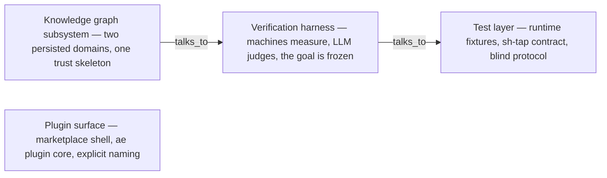

# Architecture graph

A generated map of this project's high-level design: each component is a
*synthesis page* — a short document whose every claim cites a specific line
of code or docs, and a checker re-verifies those citations still hold (a
page whose cited lines changed is marked stale). Arrows are typed
relationships read from the pages themselves. Component names are the
pages' own titles — open a component's page for the grounded detail behind
every term it uses. Regenerate with `plugins/ae/bin/graph-render-docs.py`;
do not edit by hand.

## Components

### Knowledge graph subsystem — two persisted domains, one trust skeleton

Page: [`syn-knowledge-graph`](../.ae/graph/synthesis/syn-knowledge-graph.md)
Documented for: F-069, F-072
Relationships: talks_to → syn-verification-harness

### Plugin surface — marketplace shell, ae plugin core, explicit naming

Page: [`syn-plugin-surface`](../.ae/graph/synthesis/syn-plugin-surface.md)

### Test layer — runtime fixtures, sh-tap contract, blind protocol

Page: [`syn-test-layer`](../.ae/graph/synthesis/syn-test-layer.md)

### Verification harness — machines measure, LLM judges, the goal is frozen

Page: [`syn-verification-harness`](../.ae/graph/synthesis/syn-verification-harness.md)
Documented for: F-048, F-065
Relationships: talks_to → syn-test-layer
